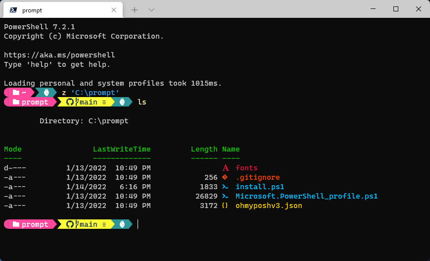

# My promot kickstarter 

On a new machine I clone this repo to `c:\prompt` and then run some winget installs from [install.ps1](install.ps1), once a bunch of things are installed that I need and I've set the fonts (mentioned in install.ps1 too) my console looks like below and super quick to get started on a new machine.

